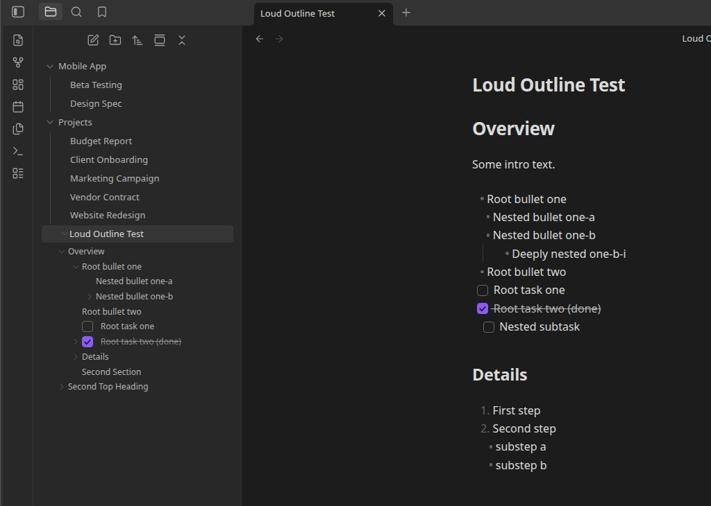

# Loud Outline

Like [Quiet Outline](https://github.com/guopenghui/obsidian-quiet-outline), but louder! Shows each
note's headings, tasks and lists as expandable/collapsible nodes **directly in
[Obsidian](https://obsidian.md)'s native file explorer** — the same interaction as a folder
expanding to reveal the files inside it, except a *file* expands to reveal its own outline.

No separate outline pane. The file tree *is* the outline.



📖 **[Full documentation](https://danrfletcher.github.io/obsidian-loud-outline/)**

## Features

- **Headings in the file tree.** Every markdown file's H1–H6 structure is parsed and rendered as
  nested, expandable child rows under that file, respecting heading level nesting (an H2 nests
  under its preceding H1, an H3 under its preceding H2, and so on).
- **Click to navigate.** Clicking a heading (or task/list) node opens the file if it isn't already
  active and scrolls the cursor to that line.
- **Tasks and nested lists, too.** Task lists (`- [ ]` / `- [x]`) and ordinary nested bullet/numbered
  lists also appear as tree nodes:
  - A list under a heading nests its root item under that heading, and any items nested inside the
    list nest the same way inside the tree.
  - A list at the top of a file (above any heading, or in a file with no headings) nests directly
    under the file itself.
- **Toggle-able.** Turn tasks/lists off in settings to fall back to headings-only.
- **Checkboxes are clickable.** Clicking a task's checkbox in the tree toggles it exactly like
  clicking that same checkbox in Reading View/Live Preview does, written straight back to the file
  — no need to open the note first.
- **Matches custom checkbox styling.** Checkboxes in the tree pick up the same styling as the note
  itself — CSS-only "alternate checkbox" snippets/themes automatically, plus exact color/label
  parity with [Checklist Status Sets](https://danrfletcher.github.io/obsidian-checklist-status-icons/)
  if it's installed, instead of always falling back to a generic checked/unchecked box. For tasks it
  governs, the dot is interactive too — left-click cycles status, right-click opens its status
  picker, right from the tree.

## Why

[Quiet Outline](https://github.com/guopenghui/obsidian-quiet-outline) and the built-in Outline core
plugin both show a note's heading structure in their own dedicated sidebar pane, disconnected from
the file tree. Loud Outline borrows that navigation mechanic but folds the result into the file
explorer itself instead of adding another pane — and extends it to tasks and lists, which neither
of those show.

## Installation

### From within Obsidian (once available in the Community Plugins directory)

Settings → Community plugins → Browse → search "Loud Outline" → Install → Enable.

### Manual

1. Download `main.js`, `manifest.json` and `styles.css` from the
   [latest release](https://github.com/danrfletcher/obsidian-loud-outline/releases/latest).
2. Copy them into `<your-vault>/.obsidian/plugins/loud-outline/`.
3. Reload Obsidian and enable **Loud Outline** under Settings → Community plugins.

## Settings

- **Show tasks and lists** — on by default. When off, the tree falls back to showing headings only.

## Development

```bash
npm install
npm run dev    # esbuild watch mode
npm run build  # type-check + production bundle
```

This follows the standard Obsidian sample plugin build setup (esbuild + TypeScript).

## License

[MIT](LICENSE)
