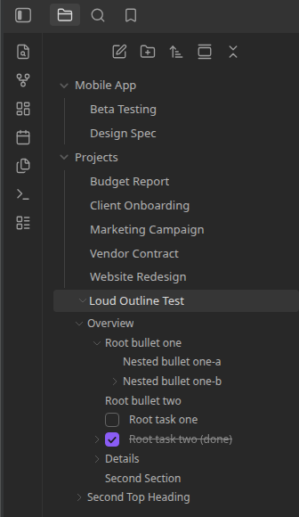

# Your First Look

Once Loud Outline is enabled, nothing changes about your file explorer until it finds something to
show you.

1. Open a note that has at least one heading — any level.
2. Look at that note's row in the file explorer. A small collapse arrow now sits to the left of the
   filename, just like the one on a folder.
3. Click the arrow (not the filename — that opens the note). The note's headings appear as indented
   rows underneath it, nested by level: an `H2` sits under the `H1` above it, an `H3` under that
   `H2`, and so on.
4. Click a heading row. If the note isn't already open, it opens; either way, the cursor jumps
   straight to that heading.
5. If the note has any headings with their own subheadings, or any tasks/lists, you'll see further
   arrows nested inside — expand as deep as you like. Everything starts collapsed, so a big note
   doesn't flood the sidebar the moment you open its first-level arrow.



## Try it with a checklist

If **Show tasks and lists** is on (it is, by default — see [Settings Reference](../settings.md)),
add a checklist under one of that note's headings:

```markdown
## Groceries

- [ ] Milk
- [x] Eggs
  - [ ] Free-range, if they have them
```

Expand that heading in the tree and the checklist appears underneath it, checked items shown
struck-through — including the nested sub-item, indented one level deeper again. Click any of them
to jump straight to that line.

## Next

- [Headings in the Tree](../reference/headings.md) covers nesting rules in full.
- [Tasks and Lists](../reference/tasks-and-lists.md) covers exactly where a list or task ends up when
  it isn't directly under a heading.
